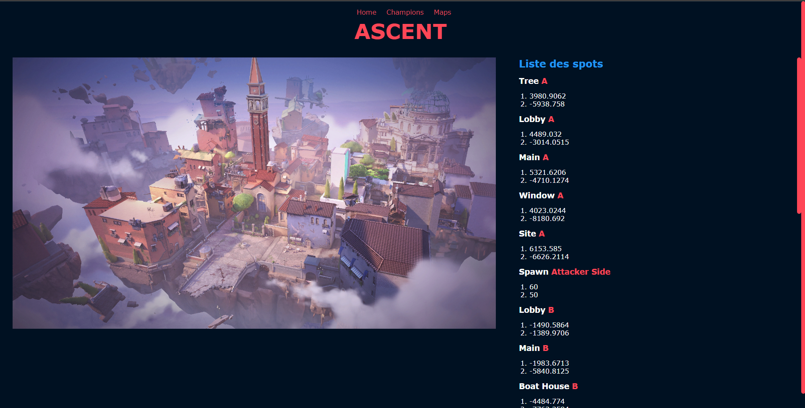

# VALORANT - Tool

**A comprehensive guide to VALORANT maps and champions, built for the gaming community 😘**

## Some examples :

  
  
  
  

## Description :

The VALORANT - Tool is a digital platform that aims to provide gamers with extensive information about the maps and champions in VALORANT. Whether you're an experienced gamer or a newbie, this guide will help you excel in your game strategy and understanding. I hope ... 

## Getting Started :

### Dependencies :

- Node.js
- npm
- Express.js
- EJS
- Dayjs
- HTML/CSS
_________________________________________________________________________
### Installing

- Clone or download the project from its GitHub repository.
- Navigate to the project directory.
- Run `npm install` to install the necessary node modules.
_________________________________________________________________________
### Executing program

- Navigate to the project's root directory.
- Run the application using: `npm start`
- Open a browser and go to `http://localhost:3000` to access the guide.
_________________________________________________________________________

### Help

For any troubleshooting:

- Ensure all the dependencies are correctly installed using npm install.
- For advanced issues or feature requests, refer to the project's documentation or raise an issue in the GitHub repository.
_________________________________________________________________________

## Authors

Vincent TRAHIN   

 
_________________________________________________________________________

## Version History

- 0.1
    - Initial Release.

(You can update the Version History as you make new releases)
_________________________________________________________________________
